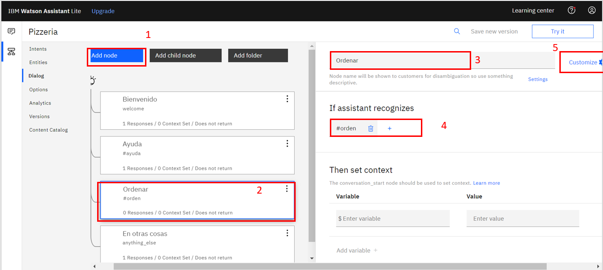
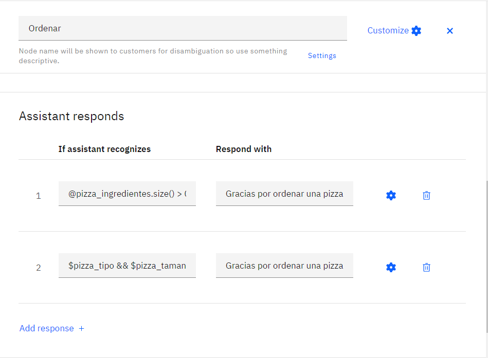

# Watson Assistant Tutorial

Este tutorial tiene el objetivo de mostrar como hacer un asistente virtual desde cero para una ordenar pizzas y posteriormente integrarlo a una página de Facebook.

## Pre requisitos

- Tener una cuenta de IBM Cloud
- De preferencia tener una página de facebook

## Tutorial

### Paso 1: Crear una instancia de Watson Assistant

1. Ingresar a IBM Cloud 
2. En el dashboard principal buscar **Watson Assistant** y seleccionarlo.

    </img>

3. Seleccionar una región, eligir el plan gratuito **Lite** y asignar un nombre y descripción (opcional) al asistente.

    </img>

4. Dar click en **Launch Watson Assistant**

    </img>

5. Dar click en **Create Assistant+**

    </img>

6. Dar un nombre y una descripción (opcional) y da click en **Create Asistente"**

    </img>

### Paso 2: Agregar un Skill

1. Dar click en **"Add dialog skill"**

    </img>

2. En la página de Skill, dar click en la pestaña **"Create a Skill"**.

    </img>

3. Dar un nombre, despcrición (opcional) y seleccionar el lenguaje de tu asistente.Dar click en **"Create Dialog Skill"**

    </img>

### Paso 3: Agregar intents

Es momento de agregar intents a nuestro asistente. Si tienes dudas de qué es un intent, puedes checar la presentación o [**la documentación oficial**](https://cloud.ibm.com/docs/assistant?topic=assistant-getting-started) . Se agregarán 3 intents: #orden, #ayuda y #saludo.

1. Seleccionar "Skill" del lado derecho, después seleccionar "Intents" y dar click en **Create Intent**.

    </img>

2. Poner el nombre del intent, en este caso **"Orden"** y dar una descripción (opcional). Crick en **Create Intent**.

    </img>

3. Agregar ejemplos del intent, en este caso pondremos todas las formas posibles en que las personas piden una pizza. **Se deben agregar mínimo 5 ejemplos para tener mejores resultados**.

    </img>

    </img>

4. Regresaremos a la página principal y crearemos el intent **Ayuda**. Repetiremos lo mismo que en el intent anterior.

    </img>

5. Finalmente agregaremos el intent de **Saludo** y repetiremos los pasos que hicimos con los intent anteriores.

    </img>

### Paso 4: Agregar entities

Es momento de agregar entities a nuestro asistente. Si tienes dudas de qué es una entity, puedes checar la presentación o [**la documentación oficial**](https://cloud.ibm.com/docs/assistant?topic=assistant-getting-started) . Se agregarán 3 entities: @pizza_tipo, @pizza_ingredientes, @pizza_tamano e @ingredientes_extra.

1. Seleccionar "Entities" del lado derecho y dar click en **Create entity +**.

    </img>

2. Agregar la entidad **pizza_tipo**. Asignar un nombre a la entidad, en este caso: **pizza_tipo**. Iremos agregando los valores de esta entidad junto con sinónimos para que se tengan mejores resultados.

    </img>

3. Agregar la entidad **pizza_tamano** para los tamaños de pizza. Realizar los mismos pasos que en la entidad anterior.

    </img>

4. Agregar la entidad **pizza_ingredientes** para los ingredientes extra. Realizar los mismos pasos que en la entidad anterior.

    </img>

5. Agregar la entidad **ingredientes_extra** para confirmar si va a querer o no clientes extra. Realizar los mismos pasos que en la entidad anterior.

    </img>

### Paso 5: Crear el diálogo

1. Seleccionar **"Dialog"** en el menú de lado derecho. Podrás ver que ya tienes dos nodos, el de "Bienvenido" y "En otras cosas". El primero es lo que se acciona cuando se inicia la conversación y el segundo cuando escribes algo que watson no entiende. Da click en el primero y podrás cambiar lo que quieres que diga tu asistente al iniciar. Puedes seleccionar la opción **random** para que se vayan alternando las respuestas cada vez que alguien entre.
**Nota: Durante todo este proceso puedes ir probando tu asistente en el botón Try it para ver si está haciendo lo que quieres.

    </img>

2. Agregar el nodo de **Ayuda**. Dar click en **Add node**. Asignarle un nombre. En la parte "If assistante recognize", vamos a seleccionar el intent **#ayuda**. En la sección "Assistant responds" poner las respuestas del asistente cuando se detecte el intent. Puedes agregar tantas como quieras.

    </img>

3. Agregar el nodo **Orden**. Dar click en **Add node**. Asignarle un nombre. En la parte "If assistante recognize", vamos a seleccionar el intent **#orden**. Dar click en **Customize**.

    </img>

4. Poner "Slots" en "On".

    </img>

5. Ahora aparecerá la sección "Then check for" donde se revisará que la orden tenga todas las entidades de tamaño, tipo e ingredientes extra. Agregar una opción por cada entidad requerida (en los ingredientes poner **@pizza_ingredientes.values**) y en "If not present ask" pondremos lo que va a preguntar el asistente en caso de que no exista información de esa entidad. En la entidad de **@pizza_ingredientes** dar click en la configuración.

    </img>

6. En la ventana emergente dar scroll hacia abajo hasta encontrar la sección de "Not Found", en esta sección se ponen las opciones para cuando el usuario quiera o no agregar ingredientes. 

    </img>

7. Ahora en la parte de "Found" se agregará que revise: **@pizza_ingredientes.length > 0**,  entonces se contesta que ya se han agreagado los ingredientes. Dar click en "Save".

    </img>

8. Volver a abrir la configuración del asistente como en el paso 2. Poner **Múltiples respuestas** en "On"

    </img>

9. Finalmente en el nodo **"Ordenar"** en la parte de "Assistant responds" , se agregarán dos opciones: para cuando la orden tenga ingredientes extra y para cuando no tenga:
  - @pizza_ingredientes.size() > 0 - Gracias por ordenar una pizza $pizza_tipo, tamaño $pizza_tamano, con ingredientes extra: <? $pizza_ingredientes.join(', ') ?>
  - $pizza_tipo && $pizza_tamano - Gracias por ordenar una pizza $pizza_tipo de tamaño $pizza_tamano
  

    </img>

10. Por último, agregar el nodo **Saludos**, asignar nombre y las respuestas correspondientes.

    </img>

### Paso 5: Probar el asistente

1. Revisa que tu diálogo se vea así:

    </img>

2. Dar click en el botón **Try it** y probar una conversación.

    </img>

### Paso 6: Conectar con Facebook Messenger

**Nota: Para este paso, necesitas tener una página donde seas administrador.**

1. En la página del asistente, en "Integraciones" dar click en **"Add Integration"**

    </img>

2. Bajar hasta encontrar la sección de "Third-party integrations" y dar click en **Facebook Messenger**

    </img>

3. Sigue los pasos que te aparecen. 

    </img>

4. Finalmente podrás probar tu chatbot en tu página de messenger.

    </img>

# Siguientes pasos

Si quieres explorar más sobre hacer asistentes te recomendamos explorar:

- [IBM Developer Page (English)](https://developer.ibm.com/)
- [IBM Cloud Docs](https://cloud.ibm.com/docs)
- [Watson Assistant](https://cloud.ibm.com/docs/assistant?topic=assistant-getting-started)
